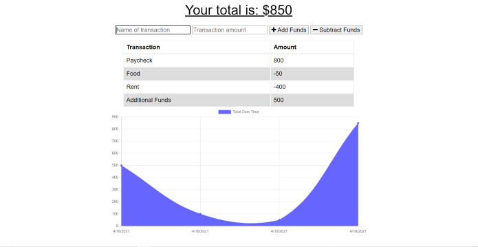

# CashedApp

## Table of Contents
* [Description](#description)
* [Installation](#installation)
* [Usage](#usage)
* [License](#license)
* [Questions](#questions)

## Description
This webpage allows the user to manage their finances and stores their transactions as cached data. The application can subsequently be used whether online or offline.  

## Installation
To install this application, add this repository to a folder of your choosing. Run npm install to acquire the necessary dependencies.

## Usage
To utilize this application, run npm start in your terminal or command prompt. Transactions can be added or subtracted from the current available funds. 

## License
This project is licensed with MIT.

## Questions
Follow me on [Github](https://github.com/Kayvonk).

To contact me, send an email to kayvonk@gmail.com with your name and inquiry.

